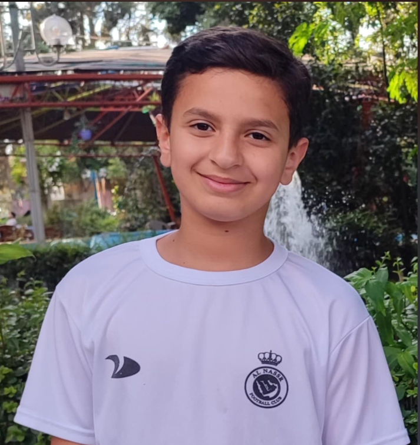

<h1 align="center">🚗🍪 Project Documentation | Team Bakers | Palestine</h1>

---

<h1>✨ Introduction</h1>

We are the **Bakers Team**, and we would like to introduce you to our autonomous car, **Cookie**!  
Cookie is more than just a project – it’s a combination of **innovation, teamwork, and problem-solving**.  

Designed for the **WRO Future Engineers** category, Cookie is equipped with:  
- 🔹 Smart sensors  
- 🔹 Precise control systems  
- 🔹 Advanced programming  

Together, these allow it to **navigate, adapt, and make decisions on its own**.  

Our goal with Cookie is not only to compete but also to explore **real-world applications of autonomous technology**. From improving road safety to reducing human error, autonomous cars represent the future of mobility – and Cookie is our step toward that future.  

Through this project, we’ve learned to collaborate, test ideas, and overcome challenges together. Every component, from **hardware** to **software**, was built and fine-tuned by our team to ensure Cookie can handle dynamic environments while staying **efficient and reliable**.  

We’re excited to share our journey with you, and we hope Cookie inspires others to **keep building, innovating, and dreaming big**. 🚀  

---

<h1>🔌 Electrical Circuit</h1>


<h3>
In this circuit, the **motor driver (L298N)** is powered directly from the battery, and it also provides a regulated 5V output that powers the **Arduino Uno**.  
The three ultrasonic sensors and the servo motor receive their 5V supply from the Arduino’s 5V pin, distributed through the breadboard.  

The **gyroscope (MPU6050)** and the **motor encoder** are powered by the Arduino’s 3.3V pin through the breadboard for signal connections.  

- 🔹 Motor driver controlled via pins 13 & 12 for direction, and pins 11 & 3 (PWM) for speed.  
- 🔹 Ultrasonic sensors: forward on pins 5 & 6, right on 7 & 8, left on 9 & 10.  
- 🔹 Encoder signal: pin 2 → allows precise motor rotation measurement for accurate navigation.  
</h3>

---

<h1>🛠️ 3D Design</h1>
 

<h3>
This is the **newly added layer** of the car.  
The 3D model illustrates the updated design, fully integrated with the existing structure.  
All components are carefully aligned for **easy assembly** and **stable performance**.  
</h3>

---

# 📂 Repository Content

<details>
<summary>1. 👥 Team Photos (t-photos)</summary>

- [c.hamed.jpg](src/t-photos/c.hamed.jpg)  
- [omar.png](src/t-photos/omar.png)  
- [rayan.png](src/t-photos/rayan.png)  
- [yazan.png](src/t-photos/yazan.png)  

</details>

<details>
<summary>2. 🚘 Vehicle Photos (v-photos)</summary>

- [README](src/v-photos/README.md)  
- [d9445cda32fcfdbb8c674becf26fcd7c.jpg](src/v-photos/d9445cda32fcfdbb8c674becf26fcd7c.jpg)  

</details>

<details>
<summary>3. 🎥 Video</summary>

- [README](src/video/README.md)  

</details>

<details>
<summary>4. 📊 Schemes & Diagrams (schemes)</summary>

- [Electrical circuit](schemes/Electrical%20circuit.png)  
- [basee](schemes/basee.png)  
- [ultrasonic holder](schemes/ultrasonic%20holder.png)  

</details>

<details>
<summary>5. 💻 Source Code (src)</summary>

- [round1/hi.cpp](src/round1/hi.cpp)  
- [round1/stage1.ino](src/round1/stage1.ino)  
- [round1/README](src/round1/README.md)  

</details>

<details>
<summary>6. 🧩 3D Models (models)</summary>

- [FT-Gear-Z20.stl](models/FT-Gear-Z20.stl)  
- [basee (1).gx](models/basee%20(1).gx)  
- [ft-gear-10.stl](models/ft-gear-10.stl)  
- [ultrasonic holder (1).gx](models/ultrasonic%20holder%20(1).gx)  
- [.gitkeep](models/.gitkeep)  

</details>

<details>
<summary>7. 🧰 Components (components)</summary>

- [Arduino Uno R3.jpg](components/Arduino%20Uno%20R3.jpg)  
- [L298N.jpg](components/L298N.jpg)  
- [MotorWithEncoder.jpg](components/MotorWithEncoder.jpg)  
- [Raspberry Pi 4](components/Raspberry%20Pi%204)  
- [RobotKit.png](components/RobotKit.png)  
- [Screenshot 2025-09-28 194134.png](components/Screenshot%202025-09-28%20194134.png)  
- [Servo_MG996R.jpg](components/Servo_MG996R.jpg)  
- [UltraSonic.jpg](components/UltraSonic.jpg)  
- [battery.jpeg](components/battery.jpeg)  
- [mpu6050.png](components/mpu6050.png)  
- [picam.jpeg](components/picam.jpeg)  
- [ultrasonic.png](components/ultrasonic.png)  

</details>

<details>
<summary>8. 📦 Other Files (other)</summary>

- [.gitkeep](other/.gitkeep)  

</details>


---

<h1>📑 Parts List</h1>
<table>
  <tr>
    <th>Component</th>
    <th>Image</th>
  </tr>
  <tr>
    <td>Arduino Uno R3</td>
    <td></td>
  </tr>
  <tr>
    <td>Raspberry Pi 4</td>
    <td></td>
  </tr>
  <tr>
    <td>Motor Driver L298N</td>
    <td></td>
  </tr>
  <tr>
    <td>Picam 3</td>
    <td></td>
  </tr>
  <tr>
    <td>Servo Motor</td>
    <td></td>
  </tr>
  <tr>
    <td>Ultrasonic HC-SR04</td>
    <td></td>
  </tr>
  <tr>
    <td>Gyroscope (MPU-6050)</td>
    <td></td>
  </tr>
  <tr>
    <td>Battery (12V)</td>
    <td></td>
  </tr>
  <tr>
    <td>Robot Kit</td>
    <td><a href="https://technolab.ps/detail/5451"></a></td>
  </tr>
</table>

---

<h2>👨‍🏫 Team Coach</h2>

- <a href="https://www.facebook.com/HamedZaferSwaiseh">Hamed Swaiseh</a>  
📧 Email: Hamed7710@gmail.com  


---

# 👥 Meet Our Team

### 🎯 Yazan Hindia


**Age:** 14  
**School:** Rasheed Moneeb Almasry Public School  
**GitHub:** [kd2o](https://github.com/kd2o)  
**Email:** [yazanhendia@gmail.com](mailto:yazanhendia@gmail.com)  

I'm passionate about **programming, cybersecurity, and building things from scratch**.  
I love tackling problems logically, experimenting with new technologies, and giving *Cookie* its **brain**.  
Outside of code, I enjoy adding **humor and creativity** to everything I do.  

---

### 🎨 Rayan Rino


**Age:** 14  
**School:** The British Scientific School  
**Email:** [rinoorayan14@gmail.com](mailto:rinoorayan14@gmail.com)  

I’m the **creative thinker** of the team.  
With a sharp eye for design and a problem-solving mindset, I make sure *Cookie* doesn’t just **run well**, but also **looks amazing**.  
I’m also the motivator who keeps the team’s energy high!  

---

### 🔧 Omar Sharaf


**Age:** 16  
**School:** Industrial Secondary School  
**Email:** [omarsharaf426@gmail.com](mailto:omarsharaf426@gmail.com)  

Omar is the **hardware wizard**.  
He loves working with **circuits, sensors, and motors**, making sure *Cookie* can move, turn, and sense the world around it.  
His **focus and precision** keep the technical side of the project solid and reliable.  

---


## 💡 Code Example

# Arduino Autonomous Robotic Car README

This project is an autonomous robotic car using Arduino, Servo motor for steering, MPU6050 sensor for orientation, and ultrasonic sensors for obstacle detection.

## 1️⃣ Libraries and Pins

```cpp
#include <Arduino.h>
#include <Servo.h>
#include <MPU6050_tockn.h>
#include <Wire.h>
```

* `Arduino.h` → Basic Arduino library.
* `Servo.h` → To control the servo motor (steering).
* `MPU6050_tockn.h` → Library to read MPU6050 (gyro + accelerometer).
* `Wire.h` → I2C communication for MPU6050.

### Pin Definitions

```cpp
#define BUTTON_PIN 4
#define MP1 13
#define MP2 12
#define SCP 11
#define SSP 3
#define trigforward 5
#define echoforward 6
#define trigright 7
#define echoright 8
#define trigleft 9          
#define echoleft 10
#define ENCODER_PIN 2
```

* `BUTTON_PIN` → Start/stop button.
* `MP1, MP2` → Motor direction pins.
* `SCP` → Motor speed (PWM).
* `SSP` → Servo control pin for steering.
* `trig*`, `echo*` → Ultrasonic sensors for obstacle detection.
* `ENCODER_PIN` → Encoder for distance measurement.

## 2️⃣ Main Variables

```cpp
Servo steering;
MPU6050 mpu6050(Wire);
volatile long encoderCount = 0;
```

* `steering` → Servo object.
* `mpu6050` → Gyro/accelerometer sensor object.
* `encoderCount` → Encoder pulse count.
* `volatile` → Modified in ISR.

## 3️⃣ Encoder Functions

```cpp
void encoderISR() { encoderCount++; }
void setupEncoder() { attachInterrupt(digitalPinToInterrupt(ENCODER_PIN), encoderISR, RISING); }
long getEncoderCount() { return encoderCount; }
void resetEncoder() { encoderCount = 0; }
```

* `encoderISR()` → Increment encoder on pulse.
* `setupEncoder()` → Setup interrupt.
* `getEncoderCount()` → Read pulses.
* `resetEncoder()` → Reset encoder.

## 4️⃣ Ultrasonic Sensor Functions

```cpp
float get_dis(int trigPin, int echoPin) {...}
int ret_avr(int trigPin, int echoPin) {...}
int get_dir() {...}
```

* `get_dis()` → Measure distance in cm.
* `ret_avr()` → Average distance of 3 readings.
* `get_dir()` → Determine direction:

  * `0` → Forward if distance > 100 cm
  * `1` → Turn right if distance > 70 cm
  * `2` → Turn left or obstacle detected

## 5️⃣ Movement Functions

```cpp
void turn_right() {...}
void turn_left() {...}
void move_forward(int speed) {...}
void move_backward(int speed) {...}
void Stop() {...}
```

* `turn_right()` / `turn_left()` → Use MPU6050 for accurate turns.
* `move_forward(speed)` → Move car forward.
* `move_backward(speed)` → Move car backward.
* `Stop()` → Stop motors.

## 6️⃣ Gyro PID Function

```cpp
float Gyro_Pid(int turns1) {...}
```

* Controls steering using gyro.
* `error` → Difference between target angle and current.
* `p` → Proportional term.
* `d` → Derivative term with filter.
* `output` → Final steering value.

## 7️⃣ Helper Functions

```cpp
bool isButtonPressed() { return digitalRead(BUTTON_PIN) == LOW; }
```

* Checks if the button is pressed.

## 8️⃣ Setup

```cpp
void setup() {
  Serial.begin(9600);
  pinMode(...);
  steering.attach(SSP);
  Wire.begin();
  mpu6050.begin();
  mpu6050.calcGyroOffsets(true);
  setupEncoder();
}
```

* Initialize pins, servo, MPU6050, and encoder.
* Calibrate gyro offsets.

## 9️⃣ Loop (Autonomous Behavior)

```cpp
void loop() {
   move_forward(255);
   Serial.println(getEncoderCount());

  if(get_dis(trigforward, echoforward)<100){
    int wanted_angle = mpu6050.getAngleZ() + 90;
    int steering_angle=0;
    while(mpu6050.getAngleZ()<wanted_angle){
       steering_angle+=5;
       steering.write(90+steering_angle);
       Serial.println(get_dis(trigforward, echoforward));
    }
 }
}
```

* Moves car forward at max speed (255).
* Prints encoder count to Serial.
* If obstacle detected (<100 cm), calculates target angle and turns the car gradually until path is clear.
* Uses MPU6050 for precise turning.

💡 **Note:** This loop implements basic obstacle avoidance and autonomous steering using ultrasonic sensors and gyro feedback.


