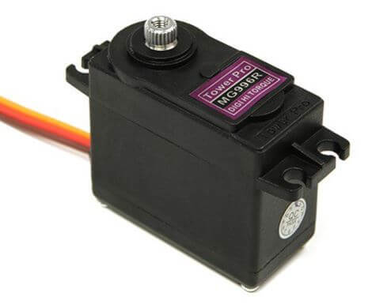

<h1>Project Documentation | Team bakers | Palestine</h1>

----
<h1>introduction</h1>

We are the Bakers Team, and we would like to introduce you to our autonomous car, Cookie!
Cookie is more than just a project – it’s a combination of innovation, teamwork, and problem-solving. Designed for the WRO Future Engineers category, Cookie is equipped with smart sensors, precise control systems, and advanced programming that allow it to navigate, adapt, and make decisions on its own.

Our goal with Cookie is not only to compete but also to explore real-world applications of autonomous technology. From improving road safety to reducing human error, autonomous cars represent the future of mobility – and Cookie is our step toward that future.

Through this project, we’ve learned to collaborate, test ideas, and overcome challenges together. Every component, from the hardware to the software, was built and fine-tuned by our team to ensure Cookie can handle dynamic environments while staying efficient and reliable.

We’re excited to share our journey with you, and we hope Cookie inspires others to keep building, innovating, and dreaming big.

----
<h1>Electrical circuit</h1>

----
<h1>3D design</h1>
 
This is the newly added layer of the car.  
The 3D model illustrates the updated design.  
It has been integrated with the existing structure.  
All components are aligned for proper assembly.  

----

<h1> content </h1>

1. Team Photos (t-photos)

- [t-photos README](t-photos/README.md)
- [Team photo file](t-photos/488643484_2903240211307105...)  

2. Vehicle Photos (v-photos)

- [v-photos README](v-photos/README.md)

3. Video

- [video README](video/README.md)
- [Video file](video/video.md)

4. Schemes & Diagrams (schemes)

- [schemes README](schemes/README.md)

5. Source Code (src)

- [src/round1 README](src/round1/README.md)

6. 3D Models (models)

- [.gitkeep](models/.gitkeep)

7. Other Files (other)

- [.gitkeep](other/.gitkeep)

<h1>Parts List</h1>
<table>
  <tr>
    <th>Component</th>
    <th>Image</th>
  </tr>
  <tr>
    <td>Arduino Uno R3</td>
    <td></td>
  </tr>
  <tr>
    <td>Raspberry Pi 4</td>
    <td></td>
  </tr>
  <tr>
    <td>Motor Driver L298N</td>
    <td></td>
  </tr>
  <tr>
    <td>Picam 3</td>
    <td></td>
  </tr>
  <tr>
    <td>Servo Motor</td>
    <td></td>
  </tr>
  <tr>
    <td>UltraSonic HC-SR04</td>
    <td></td>
  </tr>
  <tr>
    <td>Gyroscope (MPU-6050)</td>
    <td></td>
  </tr>
  <tr>
    <td>Battery (12V)</td>
    <td></td>
  </tr>
  <tr>
    <td>Robot kit</td>
    <td>/</td>
  </tr>
</table>

----

<h2>Team coach</h2>

- <a href="https://www.facebook.com/HamedZaferSwaiseh">Hamed Swaiseh<a/> - Email : <Hamed7710@gmail.com>

  

----
# 👥 Meet Our Team

---

### 🎯 Yazan Hindia

**Age: 14**

**School: Rasheed Moneeb Almasry puplic school**

**GitHub:** [kd2o](https://github.com/kd2o)  
**Email:** [yazanhendia@gmail.com](mailto:yazanhendia@gmail.com)  

I'm passionate about **programming, cybersecurity, and building things from scratch**.  
I love tackling problems logically, experimenting with new technologies, and giving *Cookie* its brain.  
Outside of code, I enjoy adding humor and creativity to everything I do.
---

### 🎨 Rayan Rino

**Age: 14**

**School: The British Scientific School**

**Email:** [rinoorayan14@gmail.com](mailto:rinoorayan14@gmail.com)  

I'm the **creative thinker** of the team.  
With a sharp eye for design and a problem-solving mindset, I makes sure *Cookie* doesn’t just run well, but looks amazing too.  
I also the motivator who keeps the team’s energy high!
---

### 🔧 Omar Sharaf

 

**Age**: 16

**School**: Industrial Secondary School

**Email:** [omarsharaf426@gmail.com](mailto:omarsharaf426@gmail.com)  

**Omar is the **hardware wizard**.  
I love working with circuits, sensors, and motors, making sure *Cookie* can move, turn, and sense the world around it.  
My focus and precision keeps the technical side of the project solid and reliable.**
